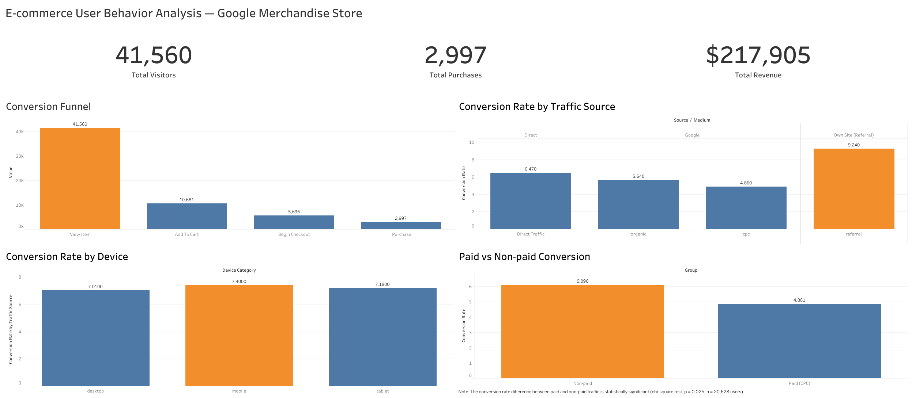

# GA4 E-commerce User Behavior Analysis

An end-to-end data analysis project exploring user behavior on the **Google Merchandise Store**, using Google's public GA4 e-commerce sample dataset. The analysis covers funnel drop-off, channel performance, device behavior, and revenue — including a statistical test to validate whether paid traffic actually underperforms organic traffic.

🔗 **[View the interactive dashboard on Tableau Public →](https://public.tableau.com/app/profile/armend.shala/viz/GA4E-commerceBehaviorAnalysis/E-commerceUserBehaviorAnalysisGoogleMerchandiseStore)**



---

## Tools & Stack

| Stage | Tool |
|---|---|
| Data querying | Google BigQuery (SQL) |
| Data analysis & statistics | Python (pandas, scipy) |
| Visualization (exploratory) | matplotlib, seaborn |
| Dashboard | Tableau Public |
| Environment | Google Colab |

## Dataset

[`bigquery-public-data.ga4_obfuscated_sample_ecommerce`](https://console.cloud.google.com/marketplace/product/obfuscated-ga4-data/obfuscated-ga4-ecommerce-data) — real (anonymized) Google Analytics 4 event data from the Google Merchandise Store, December 2020 to January 2021. Queried directly in BigQuery's free sandbox tier (no billing account required).

## Key Findings

1. **The biggest funnel drop-off happens at "Add to Cart", not checkout.** Of 41,560 users who viewed a product, only 25.7% added it to cart — but of those, over half went on to purchase. The product page / add-to-cart experience is the main friction point, not the payment flow.

2. **Paid search (Google CPC) converts significantly worse than non-paid traffic.** Grouping channels into Paid vs. Non-paid and running a chi-square test gives a statistically significant result (**p = 0.025**): Paid converts at 4.86% vs. 6.10% for Non-paid. Interestingly, testing Google CPC against Google Organic alone was *not* significant (p = 0.164) — the effect only became detectable once the sample was grouped for more statistical power.

3. **Device type has no meaningful effect on conversion.** Desktop (7.01%), Mobile (7.40%), and Tablet (7.18%) convert at nearly identical rates, contradicting the common assumption that mobile underperforms. UX investment doesn't need to be device-specific.

4. **Referral traffic converts best and spends most.** At 9.24% conversion and the highest average order value, the store's own referral traffic outperforms every paid and organic channel.

### Business recommendation

Reassess the Google CPC budget — it has both the lowest conversion rate and the lowest average order value of any channel. Consider reallocating part of that spend toward fixing the add-to-cart drop-off (the largest point of user loss, affecting every channel and device equally) and toward content/SEO work that grows the high-performing referral and organic channels.

## Repository Structure

```
├── README.md
├── notebook/
│   └── ga4_ecommerce_analysis.ipynb   # full analysis: SQL queries, pandas, chi-square test, charts
├── sql/
│   ├── 01_funnel.sql
│   ├── 02_channel_conversion.sql
│   ├── 03_device_conversion.sql
│   └── 04_revenue_by_channel.sql
└── images/
    └── dashboard_overview.png         # Tableau dashboard screenshot
```

## Methodology

1. **Query** raw GA4 event data in BigQuery to build four summary tables: funnel stages, channel conversion, device conversion, and revenue by channel.
2. **Analyze** in Python: calculate conversion rates, and test whether the paid-vs-organic conversion gap is statistically significant using a chi-square test of independence.
3. **Visualize** the four key findings as a single summary chart (matplotlib/seaborn) and as an interactive, shareable dashboard (Tableau Public).

## How to Reproduce

1. Open `notebook/ga4_ecommerce_analysis.ipynb` in Google Colab.
2. Run the first cell to authenticate and connect to BigQuery (uses the free sandbox tier — no billing setup needed).
3. Run the remaining cells in order. Each section is documented with markdown explaining what it does and why.

---

*Author: Armend Shala — part of the IBM Data Analyst Professional Certificate capstone track.*
